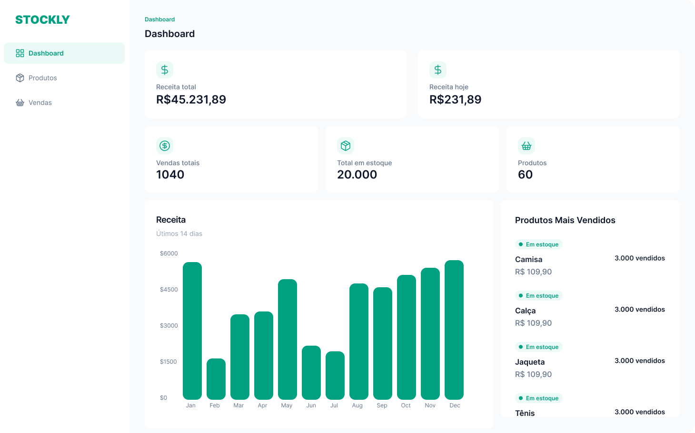

🚀 Dashboard – Projeto Fullstack Moderno

Um dashboard moderno desenvolvido com foco em performance, acessibilidade e escalabilidade, utilizando um ecossistema de tecnologias atuais e robustas.

🛠️ Tecnologias
Tecnologia	Descrição
Next.js 14	Framework React com suporte a Server Components e App Router
TailwindCSS	Estilização utilitária rápida e responsiva
TypeScript	Tipagem estática para maior segurança e produtividade
Prisma ORM	ORM moderno e intuitivo para bancos SQL
📦 Instalação
## Clone o repositório
git clone https://github.com/usuario/repositorio.git

## Acesse o projeto
cd repositorio

## Instale as dependências
npm install

## Configure as variáveis de ambiente
cp .env.example .env

## Execute as migrations do Prisma
npx prisma migrate dev

## Inicie o servidor
npm run dev

📁 Estrutura do Projeto
/___
    ├── app/          # Rotas e páginas (App Router)
    ├── components/   # Componentes reutilizáveis
    ├── lib/          # Utilidades e configurações
    ├── styles/       # Estilos globais
    └── prisma/       # Schema e migrations

📊 Telas do Projeto
Dashboard

  

▶️ Scripts úteis
npm run dev       # Ambiente de desenvolvimento
npm run build     # Build para produção
npm start         # Inicia o servidor de produção
npx prisma studio # Interface visual do Prisma
